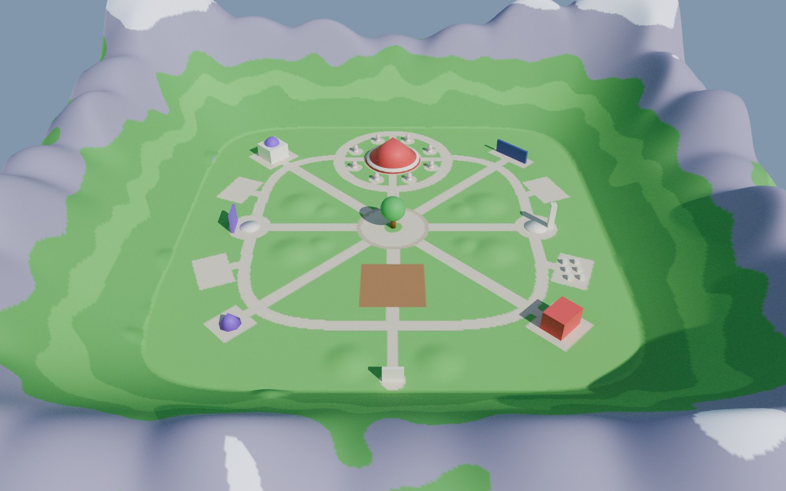
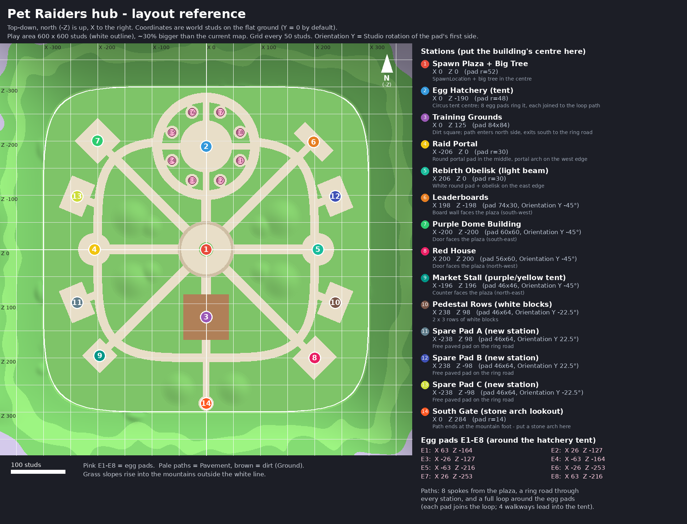

# Pet Raiders hub terrain

A new, 30% bigger hub laid out around the existing stations: paved paths to every station, a full loop
around the egg pads, and mountains on every side with bigger peaks in the four corners. The colours
match the pastel cube pets.



| File | What it is |
|---|---|
| `PetRaiders_Heightmap.png` | 1024 x 1024 greyscale heightmap, 1 pixel = 1 stud |
| `PetRaiders_Colormap.png` | 1024 x 1024 material map (exact Roblox terrain colours) |
| `PetRaiders_Layout_Reference.png` | Top-down map with every station and egg pad numbered, with coordinates |
| `layout.json` | The same layout as data: stations, egg pads, path centre lines, mounds, import settings |
| `PetRaidersTerrainSetup.lua` | Run in Studio after the import: checks it, recolours the terrain, adds markers and walls |
| `PetRaidersSnapBuildings.lua` | Optional: moves your building models onto the markers |
| `LOCAL_INSTANCE_PROMPT.md` | What to tell your local Claude after the import |
| `previews/` | Renders with placeholder buildings (oblique, inside, top-down) |
| `tools/` | The Python/Blender scripts that generate all of the above, plus tests |

## Importing it (Roblox Studio)

1. Save a backup of the place first (File > Save to File As...).
2. Open **Terrain Editor > Create > Import**.
3. Set **Position** to `0, 96, 0` and **Size** to `1024, 256, 1024`.
   This puts the flat ground at Y = 0. If your current ground top is at another height, use
   Y = (ground top) + 96 instead.
4. Pick `PetRaiders_Heightmap.png` as the heightmap and `PetRaiders_Colormap.png` as the colormap.
5. Import, wait for it to finish, then hand over to your local Claude with the message in
   `LOCAL_INSTANCE_PROMPT.md` (or run `PetRaidersTerrainSetup.lua` from View > Command Bar yourself).

The images are drawn with north (-Z) at the top. If Studio imports them mirrored or rotated, the setup
script works that out from the terrain itself, and puts the markers in the right places.

## What the setup script does

- Checks the import: which way round it landed, the ground height, and that every path, station pad and
  egg pad is paved, flat and connected. It repaints small grass gaps on paths as Pavement.
- Recolours the terrain materials (this applies to the whole place; it prints the old colours):
  Grass `124,200,106`, LeafyGrass `104,178,92`, Pavement `226,214,192`, Cobblestone `205,190,165`,
  Ground `176,128,88`, Rock `165,156,182`, Snow `246,248,255`. Grass blades are turned off for a clean
  low-poly look.
- Adds `Workspace.PetRaidersLayout`: a coloured pad marker, pole and label for each station and egg pad,
  with attributes `WorldX`, `WorldZ`, `GroundY` and `YawDeg`. Pads whose building should face the plaza
  also get a "front" dot on that side and `FacingX`/`FacingZ`. Delete the folder when you're done.
- Adds `Workspace.PetRaidersBoundary`: 8 invisible walls 335 studs out from the centre. Players can walk
  onto the foothills but can't climb the mountains.
- Running it again rebuilds those two folders. Ctrl+Z undoes it.

## Layout

The flat play area is 600 x 600 studs with rounded corners; the old map was about 460. Ground is at
Y = 0, X runs east and north is -Z. "Orientation Y" is the Studio rotation of a pad's first side.

| # | Station | X | Z | Pad |
|---|---|---|---|---|
| 1 | Spawn plaza + big tree | 0 | 0 | circle r 52, cobblestone rim, grass planter r 13 for the tree |
| 2 | Egg hatchery (tent) | 0 | -190 | circle r 48 |
| 3 | Training grounds | 0 | 125 | 84 x 84 dirt (Ground) |
| 4 | Raid portal | -206 | 0 | circle r 30 |
| 5 | Rebirth obelisk | 206 | 0 | circle r 30 |
| 6 | Leaderboards | 198 | -198 | 74 x 30, Orientation Y -45 |
| 7 | Purple dome building | -200 | -200 | 60 x 60, Orientation Y -45 |
| 8 | Red house | 200 | 200 | 56 x 60, Orientation Y -45 |
| 9 | Market stall | -196 | 196 | 46 x 46, Orientation Y -45 |
| 10 | Pedestal rows | 238 | 98 | 46 x 64, Orientation Y -22.5 |
| 11 | Spare pad A | -238 | 98 | 46 x 64, Orientation Y 22.5 |
| 12 | Spare pad B | 238 | -98 | 46 x 64, Orientation Y 22.5 |
| 13 | Spare pad C | -238 | -98 | 46 x 64, Orientation Y -22.5 |
| 14 | South gate (stone arch lookout) | 0 | 284 | circle r 14 |

Egg pads (circles r 12) ring the tent: E1 `63, -164`, E2 `26, -127`, E3 `-26, -127`, E4 `-63, -164`,
E5 `-63, -216`, E6 `-26, -253`, E7 `26, -253`, E8 `63, -216`.

Paths:
- 8 spokes (18 wide) run out from the plaza.
- A ring road (16 wide) passes every station, and each side pad has a short link onto it.
- The egg loop (18 wide) goes all the way round the egg pads. Each egg pad joins the loop, and 4
  walkways lead into the tent.
- A spur runs south through the training grounds to the south gate.

Ten low grassy mounds sit between the paths, never on them. Outside the play area, grassy foothills
roll up into the mountains, which reach about 210 studs and have lilac rock and snow tops.



## Regenerating

Needs Python 3 with numpy and Pillow; the previews need Blender 4.x; the tests need Lua 5.4.

```sh
cd art/petraiders/terrain/tools
export PETRAIDERS_TERRAIN_DIR=..
python3 make_terrain.py        # heightmap, colormap, layout.json
python3 make_layout_ref.py     # PetRaiders_Layout_Reference.png
python3 make_setup_lua.py      # PetRaidersTerrainSetup.lua (from setup_template.luau + layout.json)
blender -b --factory-startup --python preview_terrain.py -- "$PWD/oblique.png" view=oblique   # also inside / top
sh test/run_tests.sh           # runs both Studio scripts in plain Lua against simulated imports
```
